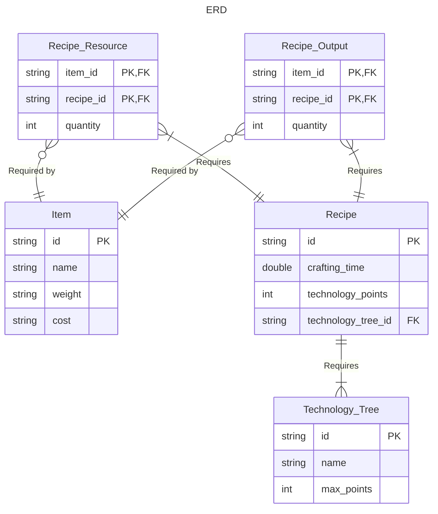
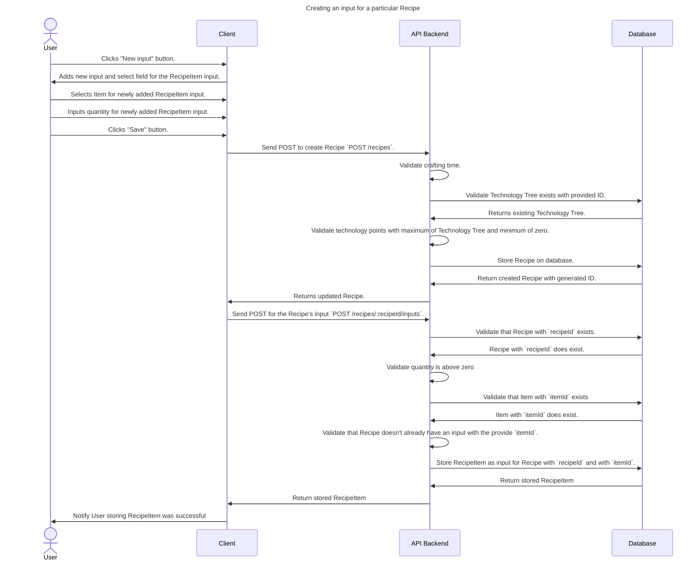
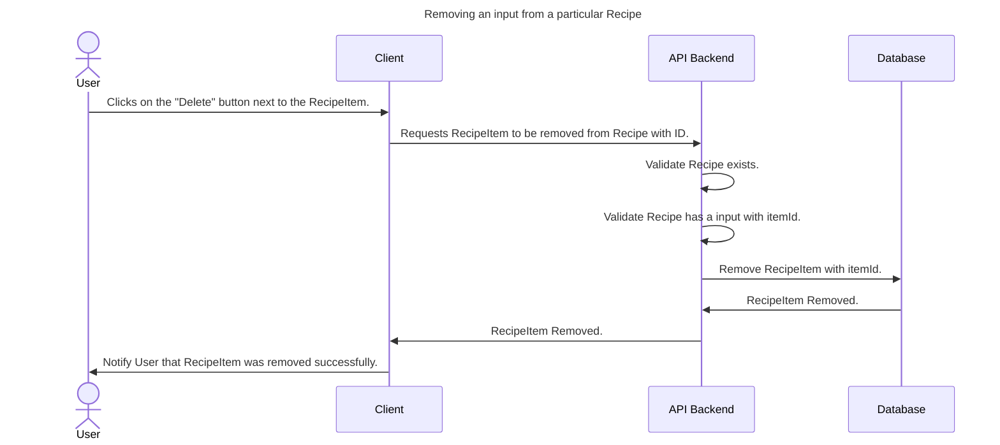

# Resources

This document will describe the resources that the API back-end will make available for the client.

## Entity Relationship Diagram



## Managing RecipeItems

Recipes have the following JSON structure:

```json
{
    "id": "string",
    "craftingTime": 1.0,
    "technologyTree": {
        "id": "string",
        "name": "technology tree name",
        "maxPoints": 5000
    },
    "technologyPoints": 250,
    "inputs": [
        {
            "item": {
                "id": "string",
                "name": "item name",
                "weight": 1.0,
                "baseValue": 1.0
            },
            "quantity": 1
        }
    ],
    "outputs": [
        {
            "item": {
                "id": "string",
                "name": "item name",
                "weight": 1.0,
                "baseValue": 1.0
            },
            "quantity": 1
        }
    ]
}
```

As shown above Recipes have `inputs` and `outputs` which can have one or more RecipeItems. The following end-points are available to view and manage these relations:

```text
GET     /recipes/:recipeId/inputs           # To get all inputs of a particular Recipe
POST    /recipes/:recipeId/inputs           # To create a new Recipe input
GET     /recipes/:recipeId/inputs/:itemId   # To view a particular input of a particular Recipe
PUT     /recipes/:recipeId/inputs/:itemId   # To update a particular input of a particular Recipe
DELETE  /recipes/:recipeId/inputs/:itemId   # To remove a particular input from a particular Recipe
```

Note that this only shows the inputs of a Recipe. The outputs however are practically the same.

To create a new input for a Recipe the client will need to send the following data:

```json
{
    "itemId": "string",
    "quantity": 1
}
```

This same data format can be sent in the PUT request to update a particular input of a particular Recipe. Below you'll find sequence diagrams on how to create or remove an input from a Recipe.




