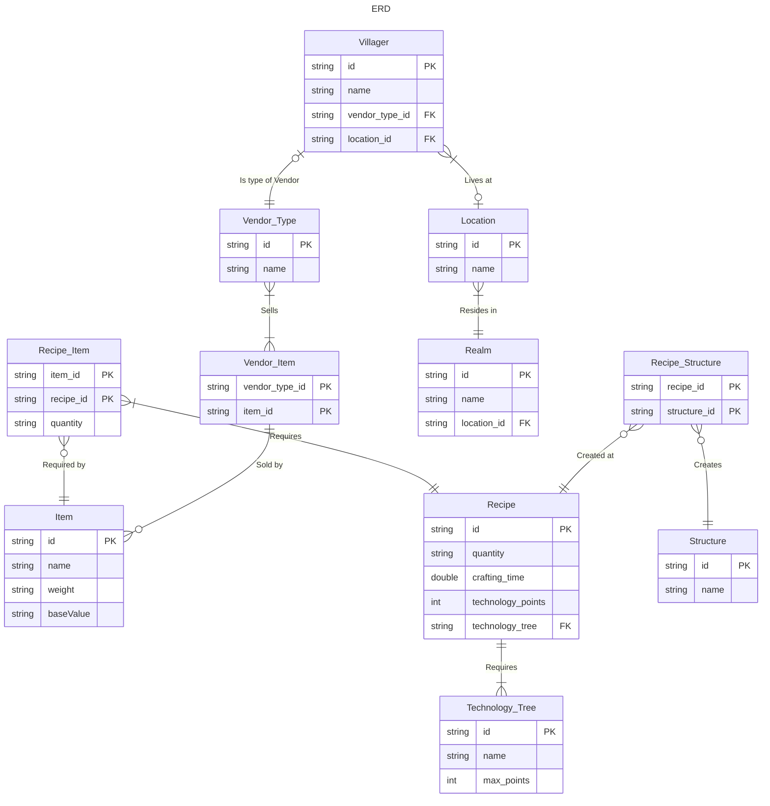

# Resources

This document will describe the resources that the API back-end will make available for the client.

```mermaid
---
title: ERD
---

erDiagram
    "Item"
    "Recipe"
    "Structure"
    "Technology_Tree"
    
    "Item" {
        string id           PK
        string name
        string weight
        string baseValue
    }
    
    "Technology_Tree" {
        string id       PK
        string name
        int max_points
    }
    
    "Structure" {
        string id       PK
        string name
    }
    
    "Recipe" {
        string id               PK
        string quantity
        double crafting_time
        int technology_points

        string technology_tree  FK
    }
    
    "Recipe_Structure" {
        string recipe_id        PK
        string structure_id     PK
    }
    
    "Recipe_Item" {
        string item_id      PK
        string recipe_id    PK
        string quantity
    }
    
    "Realm" {
        string id           PK
        string name
        string location_id  FK
    }
    
    "Location" {
        string id   PK
        string name
    }
    
    "Villager" {
        string id               PK
        string name
        string vendor_type_id   FK
        string location_id      FK
    }
    
    "Vendor_Type" {
        string id   PK
        string name
    }
    
    "Vendor_Item" {
        string vendor_type_id   PK
        string item_id          PK
    }

    "Recipe_Item" o{--|| "Item" : "Required by"
    "Recipe_Item" |{--|| "Recipe" : Requires
    "Recipe_Structure" o{--|| "Structure" : "Creates"
    "Recipe_Structure" o{--|| "Recipe" : "Created at"
    "Recipe" ||--|{ "Technology_Tree" : Requires
    "Location" |{--|| "Realm" : "Resides in"
    "Villager" |{--o| "Location" : "Lives at"
    "Villager" o|--|| "Vendor_Type" : "Is type of Vendor"
    "Vendor_Type" |{--|{ "Vendor_Item" : "Sells"
    "Vendor_Item" ||--o{ "Item" : "Sold by"
```
